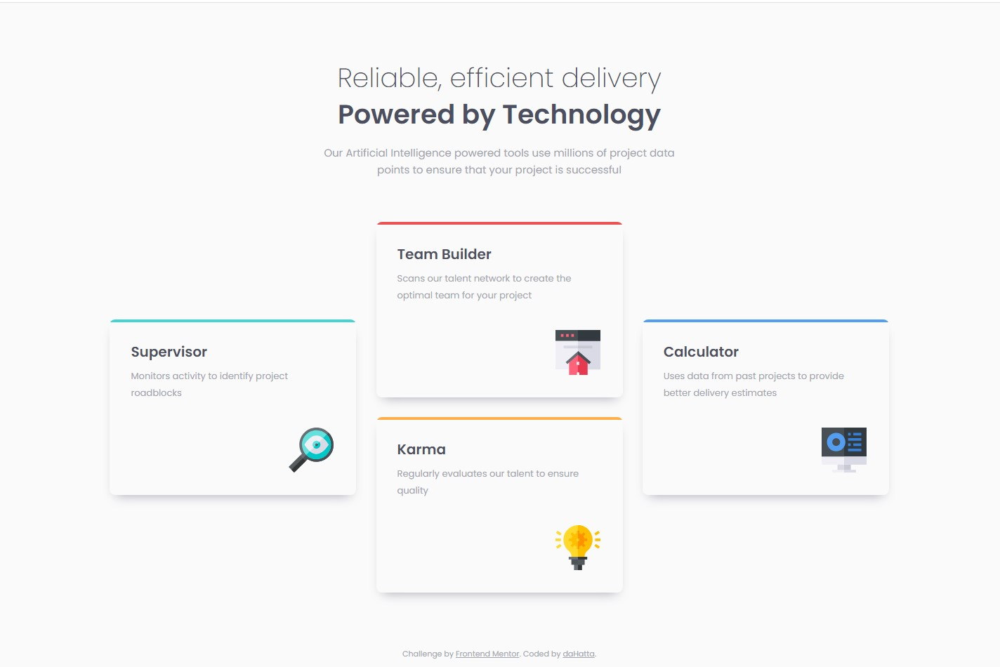

# Frontend Mentor - Four card feature section solution

This is my solution to the [Four card feature section challenge on Frontend Mentor](https://www.frontendmentor.io/challenges/four-card-feature-section-weK1eFYK).

## Table of contents

- [Overview](#overview)
  - [The challenge](#the-challenge)
  - [Screenshot](#screenshot)
  - [Links](#links)
- [My process](#my-process)
  - [Built with](#built-with)
  - [What I learned](#what-i-learned)
  - [Continued development](#continued-development)
  - [Useful resources](#useful-resources)
- [Author](#author)

**Note: Delete this note and update the table of contents based on what sections you keep.**

## Overview

### The challenge

Users should be able to:

- View the optimal layout for the site depending on their device's screen size

### Screenshot



### Links

- Solution URL: [Add solution URL here](https://your-solution-url.com)
- Live Site URL: [Add live site URL here](https://your-live-site-url.com)

## My process

### Built with

- Semantic HTML5 markup
- CSS custom properties
- Flexbox
- CSS Grid
- Mobile-first workflow

### What I learned

It was a nice project to learn about grid and flexbox as well as background images which I used in this project.

**background-image and flexbox**

```css
.card__theme {
  background-repeat: no-repeat;
  background-size: 58px 58px;
  background-position: bottom 28px right 28px;
  padding: 0 1.875em;
  display: flex;
  flex-direction: column;
  height: 100%;
}
```

**grid**

```css
.card-display {
  margin-inline: auto;
  margin-block-start: 4.125em;
  grid-template-columns: repeat(3, 1fr);
  grid-template-rows: repeat(2, 1fr);
  gap: 1.875em;
}

.card-display div:nth-child(1) {
  margin-block: auto;
  grid-column: 1;
  grid-row: 1 / 3;
}
```

### Continued development

Next step could be forms with client validation or any other projects introducing JavaScript.

### Useful resources

- [A (more) Modern CSS Reset](https://piccalil.li/blog/a-more-modern-css-reset/) - This article by **Andy Bell** helped me to reset websites for browser.
- [BEM](https://getbem.com/) - Concept of the BEM methodology is explained on this site.
- [Google Fonts](https://fonts.google.com/specimen/Poppins) - Used _Poppins_ in this project.
- [Box Shadows Generator](https://box-shadow.dev/) - Generator for customized shadows
- [background-position](https://developer.mozilla.org/en-US/docs/Web/CSS/background-position) - Helpful to understand options for positioning of background images.
- [grid](https://developer.mozilla.org/en-US/docs/Web/CSS/grid) - Nice source to learn about grid.
- [flex](https://developer.mozilla.org/en-US/docs/Web/CSS/flex) - Nice source to learn about flex.

## Author

- Frontend Mentor - [@daHatta](https://www.frontendmentor.io/profile/daHatta)
